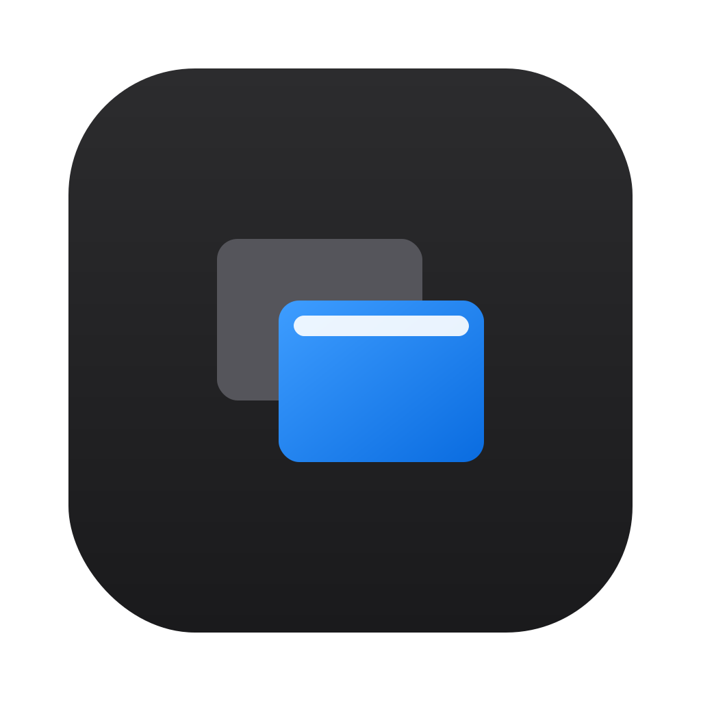
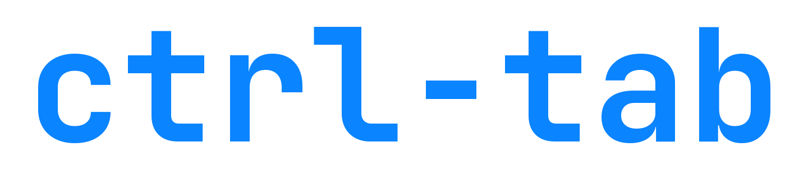

<div align="center">



<br />



<br />
<br />

**A fast, keyboard-first Alt-Tab replacement for macOS — switch apps and windows with Ctrl-Tab.**

[](./LICENSE)
[](#requirements)
[](https://tauri.app)

</div>

---

`ctrl-tab` is a small background utility that reimplements the Alt-Tab experience on
macOS. Hold **Ctrl** and tap **Tab** to flip through your applications in
most-recently-used order, or **Ctrl-§** to flip through the windows of the frontmost
app. An overlay shows the app icons; release **Ctrl** to switch. It's a single Rust
binary built with [Tauri v2](https://tauri.app) — no Dock icon, no menu-bar clutter,
**Accessibility permission only** (no Screen Recording).

<!-- TODO: add a screenshot or GIF of the overlay here, e.g.:
<div align="center"></div>
-->

## Features

- **App switcher** — `Ctrl-Tab` cycles applications in MRU order (like `Cmd-Tab`).
- **Window switcher** — `Ctrl-§` cycles the windows of the frontmost application.
- **Keyboard + mouse** — `Tab` / `Shift+Tab` to move right/left, release `Ctrl` to
  confirm, `Esc` to cancel; or hover and click an item.
- **Configurable shortcuts** — record a new combo per action in Settings; changes
  apply and persist instantly.
- **Hover tooltip** — the full, untruncated app/window name on mouse-over.
- **VS Code titles** — window titles are reordered to `project — file` for quicker scanning.
- **Silent background app** — no Dock icon and no menu-bar item while idle.
- **Launch at login** — optional, toggled from Settings.
- **JetBrains Mono** UI throughout, on a native dark "liquid glass" overlay.
- **Accessibility only** — no Screen Recording permission required.

## Requirements

- **macOS on Apple Silicon** (the release bundle is `aarch64`), macOS **13 Ventura**
  or later.
- **Xcode Command Line Tools** — `xcode-select --install`
- **Rust** (stable) — `curl --proto '=https' --tlsv1.2 -sSf https://sh.rustup.rs | sh`
  then `source "$HOME/.cargo/env"`
- **Node.js** 18+ and **npm**

## Build from source / create the `.dmg`

```bash
# 1. Clone
git clone https://github.com/pietrotartaro/ctrl-tab.git
cd ctrl-tab

# 2. Install frontend dependencies
npm install

# 3. Build the release bundle (.app + .dmg)
npm run tauri build
```

The bundle is written to:

- **`.dmg`** — `src-tauri/target/release/bundle/dmg/ctrl-tab_0.1.0_aarch64.dmg`
- **`.app`** — `src-tauri/target/release/bundle/macos/ctrl-tab.app`

To install, open the `.dmg` and drag **ctrl-tab.app** into `/Applications`.

**First launch.** The app is ad-hoc signed (not notarized), so Gatekeeper will warn
on first run. Right-click the app → **Open** → **Open**, or clear the quarantine
attribute:

```bash
xattr -dr com.apple.quarantine /Applications/ctrl-tab.app
```

**Grant Accessibility.** Open **System Settings → Privacy & Security →
Accessibility** and enable **ctrl-tab**. You can grant it while the app is running —
it polls for the permission and the shortcuts start working within ~2s, no restart
needed. Because the build is ad-hoc signed, each rebuild changes the code signature
and invalidates the previous grant: after reinstalling, remove the stale entry and
re-add it (or toggle it off/on).

For development you can run without bundling:

```bash
npm run tauri dev                 # build + run (debug)
CTRL_TAB_DEBUG=1 npm run tauri dev   # with verbose diagnostic logging
```

In `tauri dev` the *responsible process* for the event tap is your **terminal**, so
grant Accessibility to the terminal instead of the app.

## Permissions

| Permission | Required | Why |
| --- | --- | --- |
| **Accessibility** | ✅ Yes | A CoreGraphics event tap captures the `Ctrl-Tab` / `Ctrl-§` gesture, and the Accessibility API enumerates and raises windows. macOS only delivers tap events when the responsible process is trusted for Accessibility. |
| **Screen Recording** | ❌ No | ctrl-tab never reads screen contents — it shows app icons and window titles only. |

## Usage

- **Switch apps** — hold `Ctrl`, tap `Tab` to move right (`Shift+Tab` to move left),
  release `Ctrl` to switch, `Esc` to cancel.
- **Switch windows** — same, with `Ctrl-§` for the frontmost app's windows.
- **Mouse** — hover an item to select it, click to switch.
- **Settings** — launch the app again (Spotlight / Finder / `open -a ctrl-tab`) to
  open the Settings window. There you can re-record either shortcut (applied
  instantly) and toggle **Launch at login**.
- **Quit** — use the red **Quit** button in Settings. The app has no tray; closing
  the Settings window just hides it and keeps ctrl-tab running in the background.

Default shortcuts are `Ctrl-Tab` (apps) and `Ctrl-§` (windows); both are configurable.

## Tech stack

- **[Tauri v2](https://tauri.app)** — single Rust binary, macOS private API.
- **Rust** — CoreGraphics event tap, app enumeration via `objc2` / AppKit, window
  enumeration and raising via the raw Accessibility (AX) API, the overlay via
  **[tauri-nspanel](https://github.com/ahkohd/tauri-nspanel)** (a non-activating
  `NSPanel`), and native vibrancy via `window-vibrancy`.
- **React + TypeScript + Tailwind CSS**, bundled by **Vite** — the overlay and
  Settings UI.
- **[JetBrains Mono](https://www.jetbrains.com/lp/mono/)** via `@fontsource`
  (self-hosted, no CDN).

See [CLAUDE.md](./CLAUDE.md) for the full architecture, the Rust→frontend event
contract, and per-phase decisions.

## Contributing

Contributions are welcome. Please:

1. Open an issue to discuss substantial changes before starting.
2. Fork the repo and create a feature branch.
3. Keep pure logic unit-tested (`cd src-tauri && cargo test --lib`); native code
   (event tap, NSPanel, Accessibility) is verified manually — see CLAUDE.md.
4. Run `cargo build` and `npm run build` before opening a pull request.

## License

ctrl-tab is released under the [MIT License](./LICENSE) © 2026 Pietro Tartaro.

### Third-party

This project builds on the following open-source components (licenses verified from
the published packages). A full per-dependency list is in
[THIRD-PARTY-LICENSES.md](./THIRD-PARTY-LICENSES.md):

| Component | License |
| --- | --- |
| [Tauri](https://tauri.app) & official plugins (single-instance, autostart, opener) | Apache-2.0 OR MIT |
| [tauri-nspanel](https://github.com/ahkohd/tauri-nspanel) | Apache-2.0 OR MIT |
| [objc2](https://github.com/madsmtm/objc2), objc2-app-kit | Zlib OR Apache-2.0 OR MIT |
| objc2-foundation, block2 | MIT |
| core-graphics, core-foundation | MIT OR Apache-2.0 |
| [window-vibrancy](https://github.com/tauri-apps/window-vibrancy) | Apache-2.0 OR MIT |
| base64, serde, serde_json | MIT OR Apache-2.0 |
| [React](https://react.dev), React-DOM | MIT |
| [Tailwind CSS](https://tailwindcss.com), [Vite](https://vite.dev) | MIT |
| [@fontsource/jetbrains-mono](https://fontsource.org/fonts/jetbrains-mono) | OFL-1.1 |
| [JetBrains Mono](https://www.jetbrains.com/lp/mono/) (font) | SIL Open Font License 1.1 |

The JetBrains Mono font is bundled under the SIL Open Font License 1.1; its full
license text is included at [`licenses/JetBrainsMono-OFL.txt`](./licenses/JetBrainsMono-OFL.txt).
"JetBrains Mono" is a Reserved Font Name under that license.

### Acknowledgements

- Inspired by **[AltTab](https://github.com/lwouis/alt-tab-macos)**. ctrl-tab is an
  independent project and is **not affiliated with, endorsed by, or derived from**
  AltTab or Apple. No AltTab or Apple logos or icons are used.
- "macOS", "Apple", "Visual Studio Code", "PhpStorm", and "JetBrains" are referenced
  for descriptive/interoperability purposes only and are trademarks of their
  respective owners.
